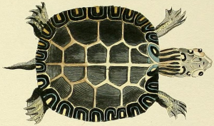
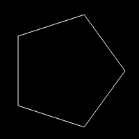

# Tortuga

Tortuga is a minimal [turtle graphics](https://en.wikipedia.org/wiki/Turtle_graphics)
implementation in JavaScript and Canvas, intended to be used in modern browsers.

## Installation

To install it just include [`tortuga.js`](https://github.com/peregrinogris/tortuga/blob/master/lib/tortuga.js)
and start using it. It has no external dependencies.

## Usage

Turtle Graphics and Logo are usually associated though they are different things.
This turtle graphics lib is not quite intended to be used by kids as it has no
special easy-to-use syntax, though it's quite simple anyway:

<table>
  <tr>
    <th>Code</th>
    <th>Output</th>
  </tr>
  <tr>
    <td>
       <pre lang="javascript">
let turtle = new Tortuga('#canvas');
for (let i = 0; i < 5; i++) {
 turtle.forward();
 turtle.right(72);
}
turtle.drawPath();
      </pre>
    </td>
    <td>
      
    </td>
  </tr>
</table>

## Documentation

For a complete documentation, check the [docs](docs/README.md) section.

If you like to learn by tinkering with some code, check out the
[examples](docs/Examples.md) folder.

## History

As I was perusing a book called [Turtle Geometry](https://mitpress.mit.edu/index.php?q=books/turtle-geometry) (Abelson,
Harold, Andrea A. diSessa. *Turtle Geometry*. Cambridge: MIT Press, 1983. Print.)
I got interested in trying out the examples and exercises and I needed a tool to
do it.

I did a brief search and couldn't find something simple enough and without any
dependencies, almost all that I found were Logo implementations. Since it didn't
seem overly complex, I decided to roll my own one and Tortuga was born.

The picture on top is from:
Schöpf, Johann David.
[*Naturgeschichte der Schildkröten*](http://dx.doi.org/10.5962/bhl.title.58644).
Erlangen: Johann Jakob Palm, 1792. Print.
