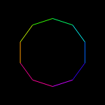
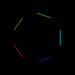

# Documentation
### Constructor
<a name="tortuga" href="#tortuga">#</a> *Tortuga*(*canvasSelector*, *initx*, *inity*, *length*)

Create a new `Tortuga` object, parameters are:

 Parameter | Description
 ----------|------------
 *canvasSelector* | String, canvas element selector (optional, default: `#tortuga`)
 *initx*          | Int, initial X coordinate (optional, default: `0`)
 *inity*          | Int, initial Y coordinate (optional, default: `0`)
 *length*         | Int, default length in pixels used by forward (optional, default: `100`)

The point of origin `(0, 0)` is at the center of the canvas element. The
starting color is white on a black background.

### Tortuga Properties

A `Tortuga` object has the following properties that can be directly modified in
case they are needed:

Parameter | Description
----------|------------
*ctx*       | The canvas context object.
*position*  | An int array `[x, y]` with the turtle's current position.
*direction* | An int with the turtle's direction, expressed in deg (0 <= *direction* < 360). Measured clockwise from the Y axis.
*length*    | The default lenght the turtle moves with `forward`/`backward`.
*penColor* | The current css color string the pen is using.
*palette* | List of saved colors. See below.

#### Palette

A `Tortuga` object has a list of pre-set colors, that can be modified and
extended at will. The current colors are:

  1. black
  2. blue
  3. green
  4. cyan
  5. red
  6. magenta
  7. yellow
  8. white
  9. brown
  10. tan
  11. forest
  12. aqua
  13. salmon
  14. purple
  15. orange
  16. grey

The list is an array stored in the `palette` property of the `Tortuga` object,
and each element is an integer array with the RGB components of the color. For
example this would be a way to add a new color:

```js
var turtle = new Tortuga();
turtle.palette.append([153, 51,153]); // Add another purple
```

***Beware:*** Don't mess up this array otherwise the `color` method may
 misbehave!

### Motion commands
<a name="forward" href="#forward">#</a> *Tortuga*.**forward**(*length*)

Move forward the specified length in pixels, or use the default one.

<a name="back" href="#back">#</a> *Tortuga*.**back**(*length*)

Move backward the specified length in pixels, or use the default one.

<a name="setXY" href="#setXY">#</a> *Tortuga*.**setXY**(*x*, *y*)

Move the turtle to the specified absolute [*x*, *y*] position.

<a name="setX" href="#setX">#</a> *Tortuga*.**setX**(*x*)

Move the turtle horizontally to the new *x* coordinate.

<a name="setY" href="#setY">#</a> *Tortuga*.**setY**(*y*)

Move the turtle vertically to the new *y* coordinate.

<a name="right" href="#right">#</a> *Tortuga*.**right**(*angle*)

Rotate the turtle by the desired angle in deg, clockwise.

<a name="left" href="#left">#</a> *Tortuga*.**left**(*angle*)

Rotate the turtle by the desired angle in deg, counterclockwise.

<a name="setHeading" href="#setHeading">#</a> *Tortuga*.**setHeading**(*heading*)

Set the turtle absolute heading to the specified angle in deg. *heading* should
be an integer between 0 and 360.

<a name="home" href="#home">#</a> *Tortuga*.**home**()

Move the turtle to it's initial position at [0, 0] and heading 0.

### Pen Commands
<a name="drawPath" href="#drawPath">#</a> *Tortuga*.**drawPath**()

Draw the current turtle path, and begin a new one. Usually this function should
be called at the end to draw the path traveled by the turtle. Changing the pen
color triggers this function as it's a canvas requirement.

<a name="color" href="#color">#</a> *Tortuga*.**color**( *paletteIndex* | *r*, *g*, *b* | *colorString*)

Change the pen color, draws the current path. Accepts multiple parameters:
  * 1 int with a `palette` color index
  * 3 int parameters for each of the RGB channels
  * 1 string parameter with a CSS color.

```js
var turtle = new Tortuga();
turtle.color(5); // Sets the pen to red
turtle.color(255, 0, 0); // Also sets the pen to red
turtle.color('rgb(255, 0, 0)'); // You know, this also sets the pen to red
turtle.color('hsl(0, 100%, 50%)'); // This time set the pen to red using HSL
```

<a name="rainbow" href="#rainbow">#</a> *Tortuga*.**rainbow**(*step*, *totalSteps*)

Step the pen color through the rainbow and draw the current path. Divides the
spectrum in `totalSteps` steps, and sets the color to the desired step with `step`.

<table>
  <tr>
    <th>
    Code
    </th>
    <th>
    Output
    </th>
  </tr>
  <tr>
    <td>
      <pre lang="javascript">
var turtle = new Tortuga(),
    angle = 36,
    sides = 360 / angle;
for (var step = 0; step < sides; step++){
  turtle.rainbow(step, sides);
  turtle.forward();
  turtle.right(angle);
}
turtle.drawPath();
      </pre>
    </td>
    <td>
      
    </td>
  </tr>
</table>

<a name="penUp" href="#penUp">#</a> *Tortuga*.**penUp**()

Lifts the pen, draws the current path. Any movement made after `penUp` and before
`penDown` won't be traced in the canvas.

<a name="penDown" href="#penDown">#</a> *Tortuga*.**penDown**()

Gets the pen down. Any movements after calling `penDown` will be traced in the
canvas. Below is an example of `penUp` and `penDown` combined:

<table>
  <tr>
    <th>
    Code
    </th>
    <th>
    Output
    </th>
  </tr>
  <tr>
    <td>
      <pre lang="javascript">
var turtle = new Tortuga(),
    angle = 36,
    sides = 360 / angle;
for (var step = 0; step < sides; step++){
  // Only trace the odd sections
  if (step % 2 == 0) {
    turtle.penUp();
  } else {
    turtle.penDown();
  }
  turtle.rainbow(step, sides);
  turtle.forward();
  turtle.right(angle);
}
turtle.drawPath();
      </pre>
    </td>
    <td>
      
    </td>
  </tr>
</table>

<a name="isPenDown" href="#isPenDown">#</a> *Tortuga*.**isPenDown**()

Gets the pen status. True if the pen is down, false if it's up.

<a name="clean" href="#clean">#</a> *Tortuga*.**clean**()

Clean the current turtle drawing.

<a name="reset" href="#reset">#</a> *Tortuga*.**reset**()

Clear the current turtle drawing and reset turtle position
